[English](README.md) | Translated by AI([日本語](README.ja.md) | [简体中文](README.zh-Hans.md) | [繁體中文](README.zh-Hant.md))

# Arondo

Arondo 是一個以行動為優先的開發人員工作區，它將編碼任務委託給 AI Agent 並監控多台機器的執行情況。它遵循 **Frontend + Server + Runner** 架構，其中基於 Go 的輕量級 Runner 安裝在開發機器上，中央 Server 協調所有操作。

## 基本工作流程

Arondo 讓使用者可以從適合行動裝置的工作區將工作委派給 AI Agent，查看更改、驗證更改，並繼續相同的對話，直到任務準備好提交。

### 1. 開始會話

選擇 Runner、項目和 Agent，然後描述任務並發送。

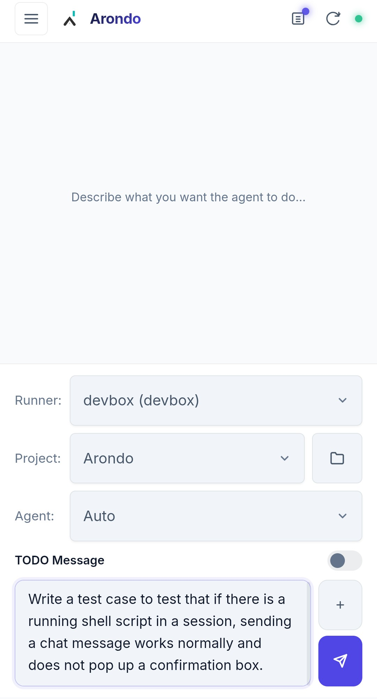

### 2. 審查、驗證和提交

查看 Agent 結果和差異、運行驗證、在需要時提供後續說明，並透過在同一會話中提交已完成的工作來完成。

<p>
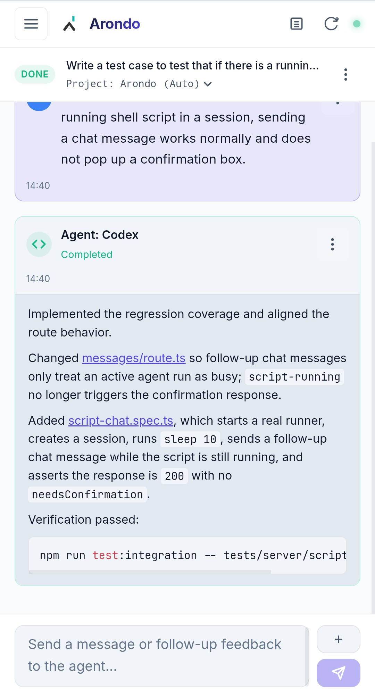
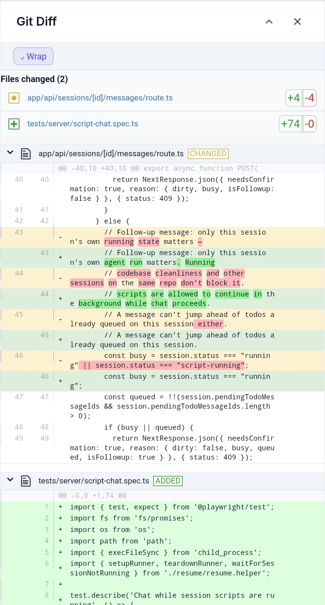
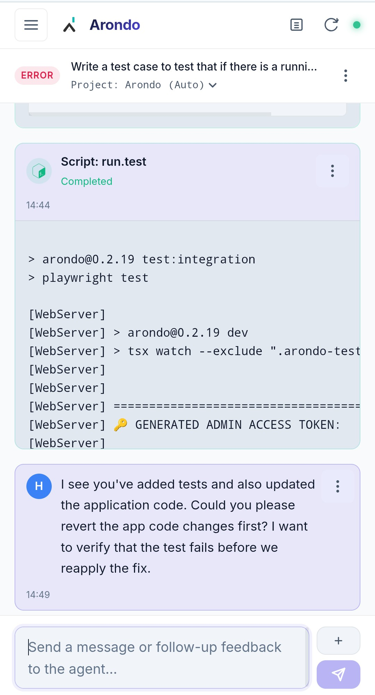
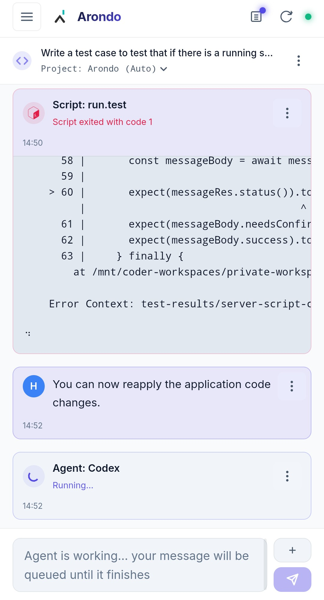
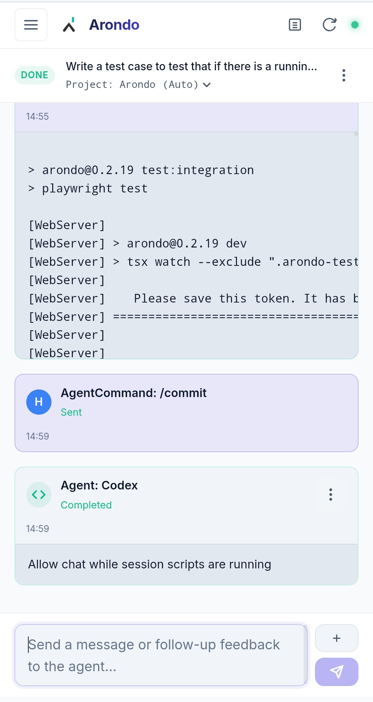
</p>

## Agent Commands

在 **設定 → Agent Commands** 中定義指令名稱、傳送給 Agent 的內容，以及（需要時）正規表示式比對器；其擷取群組可作為 `$1`、`$2` 等插入。然後在會話中輸入 `/`，即可瀏覽並執行內建與自訂指令。

<p>
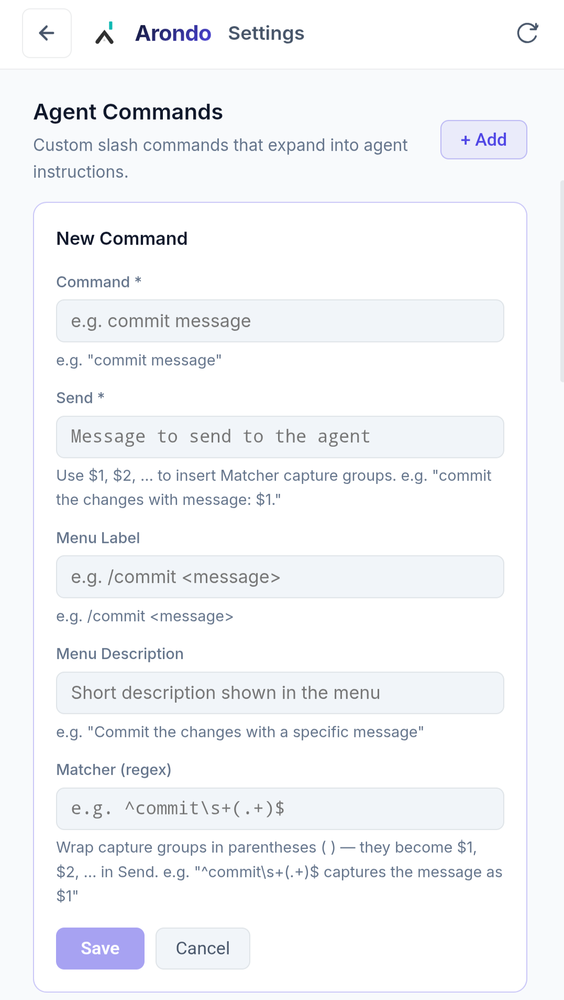
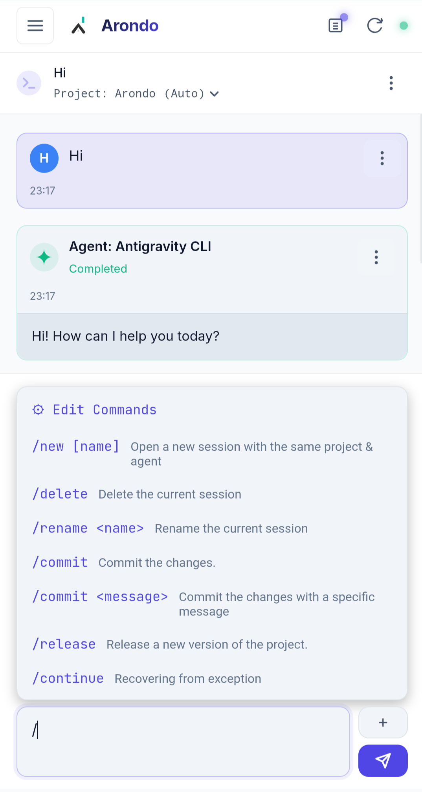
</p>

## Script

透過 **編輯 Script** 儲存專案的命名 shell 命令，然後在會話中輸入 `!` 以選擇並執行它，選擇要執行的文件，或輸入臨時命令。

<p>
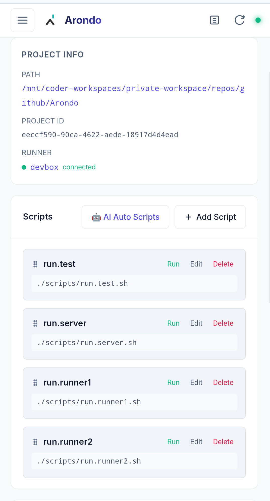
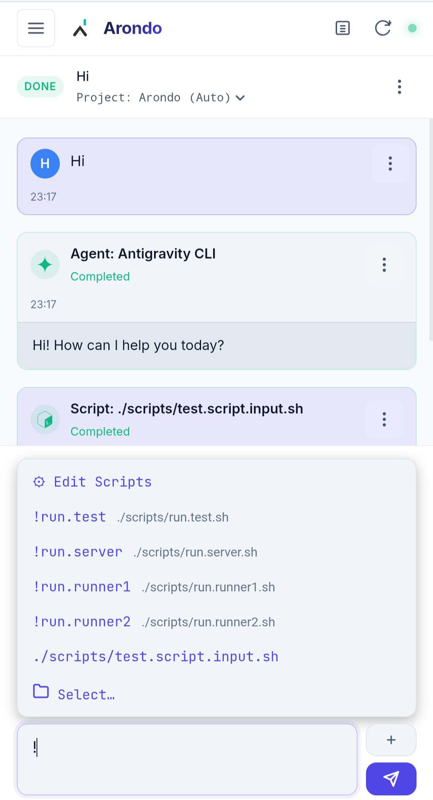
</p>

## 終端

當使用者需要檢查異常情況或從異常情況中恢復時，可以從會話的三點選單中在選定的 Runner 上開啟即時 shell。

> **僅供備用：** Arondo 是以 Agent 與已儲存的 Script 為核心設計，這才是建議的工作方式。終端僅供緊急情況使用，並非主要工作流程；在行動裝置的小螢幕上操作命令列介面相當不便。

<p>
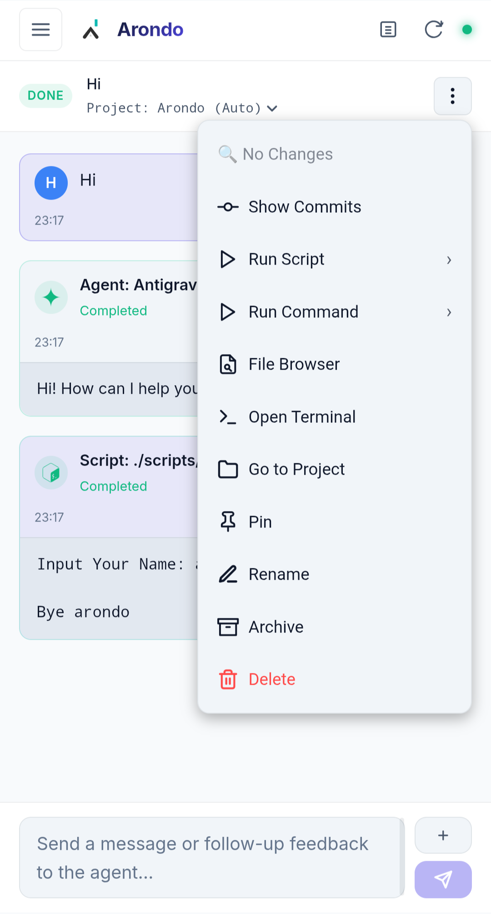
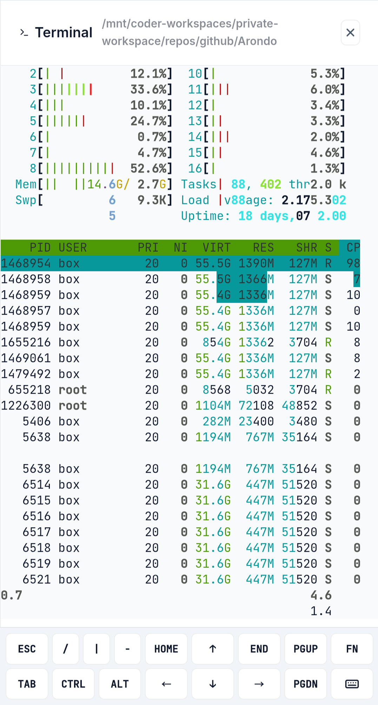
</p>

## Todo 訊息

當存在運行中的 AI Agent 或有未提交的變更時，將提示儲存為 Todo 訊息，然後選擇是在程式碼庫準備好後自動發送、稍後手動發送或在預定時間發送；待處理的訊息在調度前會一直顯示在會話中。

<p>
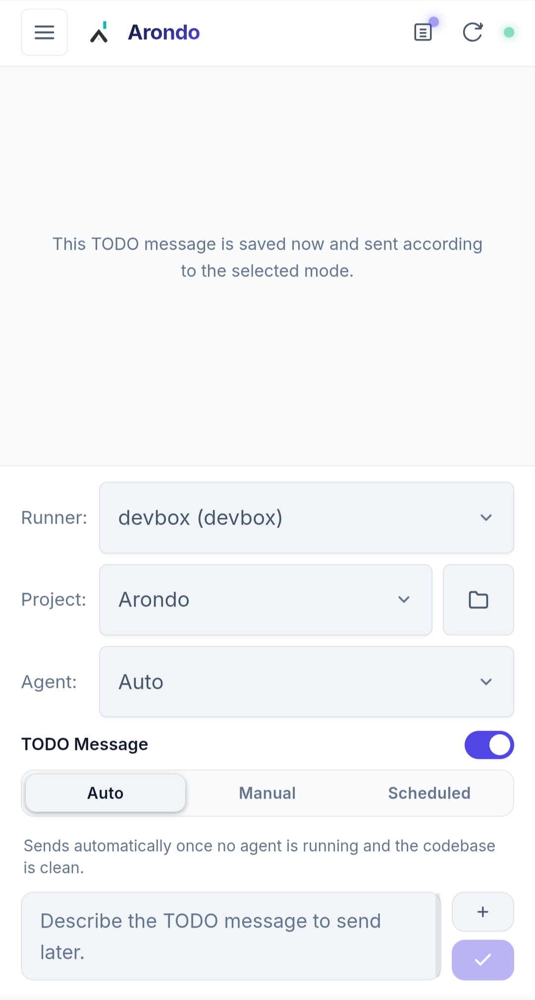
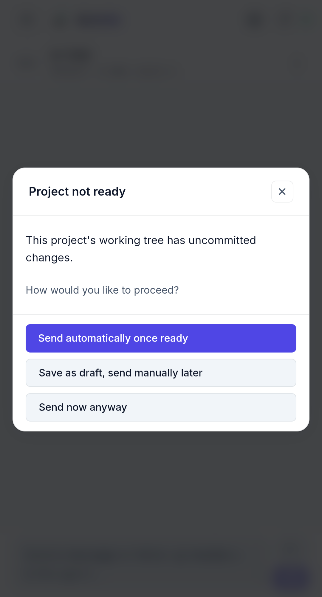
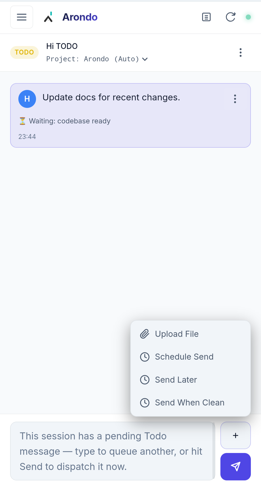
</p>

## Auto Mode

在 Agent 選擇器中選擇 **Auto**，讓 Arondo 在所選 Runner 上已安裝的 Agent CLI 之間做出選擇。**Runner** 頁面顯示為此選擇提供依據的配額資料。

Auto Mode 使用以下優先順序：

1. 考慮安裝具有已知訂閱配額的 Antigravity、Claude 和 Codex CLI； API 金鑰計費帳戶被保留作為最後的手段。
2. 當其他候選 Agent 的可用配額充足時，降低每小時剩餘配額低於 15% 的 Agent 優先順序；如果所有候選 Agent 的配額都偏低，則保留所有候選 Agent。
3. 根據每週剩餘配額為其餘候選 Agent 排序，並依距離每週重設的剩餘時間調整。
4. 如果不知道訂閱配額，請使用配額未知的 Agent，然後再回退到 API 金鑰計費 Agent。

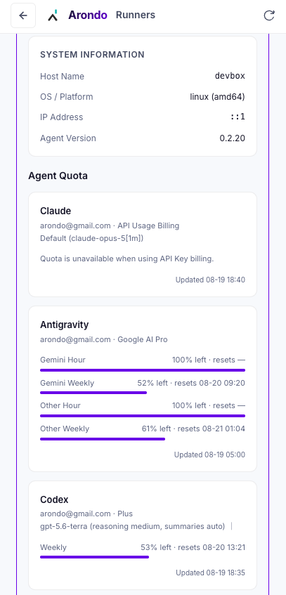

## Agent 模型與預設設定

在 **設定 → Agent Models & Defaults** 中自訂各個 Agent 的預設模型與可選模型清單：

- **Antigravity CLI (agy)**：針對 Antigravity 的配額層級，分別設定 **Gemini Group** 與 **Others Group**（Claude 等其他模型）。
- **Claude Code (claude)**：自訂透過 `--model` 傳遞的預設模型與可選模型清單。
- **Codex CLI (codex)**：自訂傳遞給 OpenAI Codex 的預設模型與推理強度（effort）選項。

Arondo 會自動偵測 CLI 輸出中的 `invalid model selection` 錯誤（如模型被廢棄或名稱變更），並引導使用者在設定頁面更新模型。

## 存取控制

使用三個相關控制項從 **設定** 配置身份驗證：

- **System Access Tokens** 對 Arondo 進行人員和自動化的身份驗證。建立 `admin` Token 以實現完全管理訪問，並建立 `user` Token 以實現受限訪問；Token 值僅在生成時完整顯示，因此請安全儲存它們。
- **Runner Tokens** 對每台 Runner 機器進行身份驗證。每個 Runner 產生一個專用 Token，並透過 `--token` 或 `ARONDO_RUNNER_TOKEN` 傳遞；它綁定到第一個連接的 Runner 身份，防止洩漏的 Token 冒充不同的 Runner。
- **Runner Access Control** 授予單一 `user` Token 對選定 Runner 的存取權。管理 Token 可以存取每個 Runner；使用者只能存取明確包含其 Token 的 Runner，因此沒有選定用戶的 Runner 仍僅具有管理員權限。

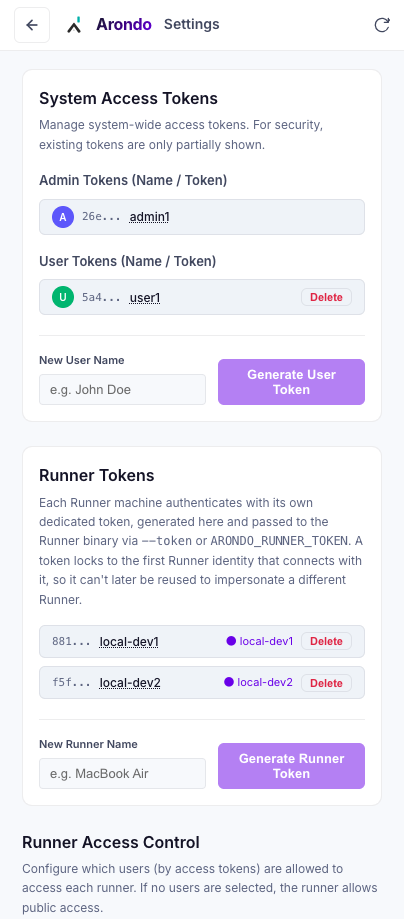

## 架構

```
Browser (Next.js UI)  <--ws-->  Server (Next.js)  <--ws-->  Runner A (Go, machine-1)
                                                  <--ws-->  Runner B (Go, machine-2)
```

- **Runner** (`runner/`)：透過 WebSocket 連接到 Server 的 Go 二進位。執行指令、管理 PTY 會話、執行 git/檔案系統操作。最小配置 — 只需一個 Server URL 和 Token。
- **Server**：將操作路由到 Runner。管理所有持久狀態（會話、項目、訊息、日誌）。服務於前端。
- **前端**：單頁 React UI，具有 Runner 選擇、檔案瀏覽、聊天、終端模式和任務佇列。

所有執行都通過 Runner - Server 上沒有本地回退。

## 功能

- **多機 Runner**：在任何開發機器上安裝 Go Runner。使用者介面可讓使用者選擇哪個 Runner 運行每個會話。支援從 Runner 儀表板中刪除斷開連接的 Runner。
- **Todo 訊息（草稿、計畫發送、自動佇列跟進和配額重試）**：「稍後發送此訊息」是一條帶有狀態/觸發器（手動、程式碼庫就緒、afterSession、quotaAvailable 或固定時間）的 `user-todo` 程式碼庫就緒、afterSession、quotaAvailable 或固定時間）的 `user-todo` 聊天訊息，透過三點選單（取消///更改觸發/更改觸發涵蓋專案有未提交的變更或正在運行的 Agent 時保存的 TODO 草稿、在正在運行的 Agent 後面排隊的後續操作以及自動配額耗盡重試 - 所有這些都在任務儀表板中顯示為一級任務。一個會話可以同時對多個 Todo 訊息進行排隊；當存在草稿/待處理 Todo 時，聊天輸入保持啟用狀態，以便使用者可以繼續撰寫進一步的後續內容。聊天輸入的“+”彈出式選單提供“上傳文件”、“稍後發送”（手動）、“清理時發送”（代碼庫就緒）和“安排發送”（選擇未來的日期/時間）——所有這些都由相同的 Todo 訊息管道支援。由於 Server 重新啟動而在發送過程中卡住的預定（“at”）Todo 將自動解析為 `failed`，而不是掛起。
- **會話存檔**：自動存檔空閒時間超過配置時間的會話，或手動存檔/取消存檔它們。固定會話免於自動存檔。存檔會話是唯讀的，以防止發送新訊息，同時保留歷史記錄、日誌和差異視圖。自動存檔前的預設空閒天數可在「設定」頁面中設定。如果會話的父項目已被刪除，則取消歸檔工作階段將會停用。在刪除項目之前，警告對話方塊會標記所有可能變得不可用的關聯存檔工作階段。
- **最近的會話、固定、過濾和三點選單**：側邊欄以最近的會話為中心，帶有輕量級的存檔會話提示，而不是單獨的項目標籤。將重要會話固定到頂部（按固定時間戳排序），在需要時按項目或 Runner 進行過濾，並使用每個會話的三點選單來固定、重新命名、存檔或刪除它。
- **專案就緒警告**：當項目有未提交的變更或正在執行的 Agent 時，在建立會話或在空會話上傳送第一則訊息之前發出警告，提供無論如何傳送、準備好後自動傳送或儲存為 TODO 會話的選項。當 Agent 已經運行時，“無論如何立即發送”選項將被隱藏，因為在這種情況下 Server 總是拒絕它。已具有歷史記錄的會話上的後續訊息將跳過此檢查，並且僅阻止該會話自己的運行狀態或已排隊的 Todo。
- **項目三點選單**：項目頁面標題提供了一個三點選單，其中包含文件瀏覽器、開啟終端、顯示變更（項目工作樹的無會話視覺差異，清理時停用）和刪除項目。
- **基於多用戶 Token 的身份驗證**：使用支援 `admin` 和 `user` 角色的基於 Token 的身份驗證來保護應用程式。如果尚未配置，則在首次啟動時自動產生管理員存取 Token。客戶端 Token 支援自訂名稱和不同的顏色，這些名稱和顏色與寄件者頭像一起顯示在使用者訊息卡上。管理員可以從「設定」儀表板管理存取 Token 並配置特定於 Runner 的存取控制清單（將 Runner 限制為特定使用者 Token UUID）。
- **安全性 WebSocket 通訊**：透過 `Sec-WebSocket-Protocol` 標頭 (`arondo-token`) 傳遞身份驗證 Token 來保護瀏覽器到 Server 的 WebSocket 連接，從而防止查詢參數或 Server 日誌中的敏感憑證暴露。
- **基於會話的工作空間**：每個任務都封裝在配置目錄（預設為 `~/.arondo/sessions/[sessionId]/`）下的獨立會話中，追蹤歷史記錄、設定和輸出。
- **精細執行日誌記錄**：每個 CLI 指令執行的輸出都單獨記錄在 `~/.arondo/sessions/[sessionId]/logs/[messageId].log` 下，當 Agent 在管道模式下執行時，stderr 會在相鄰的 `.stderr.log` 檔案中擷取。可以從 Agent 執行卡的選單（顯示 Stderr）以模式查看 Stderr 輸出。
- **多個 AI Agent 程式支援**：支援用於程式碼產生任務的 **反重力 CLI (agy)**、**Claude Code**、**Codex** 和 **OpenCode**。
- **互動終端機 (PTY)**：Agent 和 Script 執行都透過 Go 的 `creack/pty` 在完整的偽終端中運行，並使用 `xterm.js` 在瀏覽器中呈現。支援互動式標準輸入、ANSI 顏色和遊標控制。 PTY 確保 Runner 退出時可靠的進程清理 (SIGHUP)。互動式 shell 終端直接在 Runner 上生成，而不是在 Server 上生成。
- **行動終端鍵盤欄**：包括用於終端模式的特定於行動裝置的特殊鍵欄（ESC、TAB、CTRL、ALT、箭頭和 F1-F12 的 FN 層）。它動態追蹤 VisualViewport 將其固定在虛擬鍵盤上方，防止鍵盤阻塞。
- **專用執行卡和豐富的 Markdown 視圖**：Script 執行使用 `ScriptExecCard`（支援快速運行命令的內聯日誌流），而 Agent 執行使用 `AgentExecCard`，它將輸出呈現為帶有語法突出顯示 (`rehype-highlight`) 和可點擊檔/URL 連結的 Markdown。按一下已驗證的檔案路徑會自動開啟遠端檔案瀏覽器。使用者可以直接從卡片的選單複製格式化的 Markdown 輸出或原始文字輸出。用戶還可以使用用戶聊天卡上的複製操作來複製聊天訊息。
- **終端會話持久性與重新附加**：終端會話在瀏覽器刷新或關閉事件中持續存在。重新開啟終端機會自動重新連線到 Runner 上的活動 PTY 工作階段並重播輸出緩衝區。
- **配額和會話限制偵測**：透過掃描 stdout 和 stderr 日誌自動偵測 AI Agent API 限制（例如 Claude 的會話限制命中、Codex 限製或 `agy` 配額錯誤，包括個人配額耗盡和訂閱升級警告）並顯示人類可讀的錯誤訊息。
- **AI Agent 配額監控**：透過 Runner 上的 tmux 自動收集 Claude、Antigravity 和 Codex 的配額使用數據，識別 API 密鑰計費帳戶，並在 Runner 儀表板中顯示已知的剩餘配額或明確的未知狀態。
- **AI Agent 自動選擇（Auto Mode）**：從已知訂閱配額中自動選擇最佳 Agent 和模型，優先選擇可用容量而不是未知數據，並僅使用 API 密鑰計費選擇作為最後的後備。
- **手動 Agent 切換**：當 Agent 空閒時，在現有會話中即時切換活動 Agent（Antigravity CLI、Claude Code、Codex、OpenCode 或 Auto）。
- **Agent 會話連續性（恢復）**：同一會話中的對話保留其特定於 Agent 的歷史記錄。 Claude Code 使用本機恢復支持，Codex CLI 存儲並重用 Codex 會話 ID，OpenCode CLI 存儲並重用 OpenCode 會話 ID，Antigravity CLI (agy) 存儲檢測到的對話 ID 以供後續 `--conversation` 運行。
- **安全性提示傳遞**：使用臨時檔案和環境變數（使用 `ARONDO_PROMPT_FILE` 環境變數）將提示傳遞給 Agent，避免 shell 命令列長度限制並在命令參數中暴露敏感提示。在「顯示提示」面板中顯示真正解析的提示，而不是原始輸入。
- **並發 Script 執行**：允許在單一會話中同時執行多個 Script。用戶可以在後台 Script 運行時繼續聊天。也支援在 Agent 執行時運行專案範圍的 Script。
- **全域和會話範圍的 Script**：支援在全域（獨立於會話，直接從專案面板）或在特定會話中執行專案範圍的自訂 Script。
- **配置驅動和自訂斜線指令**：內建斜線指令（例如 `/new`、`/delete` 和 `/rename <name>` 來重新命名目前會話）和自訂使用者定義 Agent 斜線指令是配置驅動且可自訂的。使用者可以透過「設定」中的 **Agent Commands** 管理 UI（預設儲存在 `~/.arondo/agent-commands.json` 中）配置使用者定義的 Agent 斜線命令，並支援正規表示式匹配器和替換擴充。
- **智慧型聊天輸入、草稿和檔案上傳**：支援 Tab 完成以循環顯示命令選單中的斜線命令。支援輸入 `@` 符號觸發開啟檔案/目錄選擇器模式並將相對路徑插入聊天輸入。聊天輸入支援直接檔案上傳（檔案被傳送到 Runner 的臨時目錄，並將解析的路徑傳遞給 Agent）。每個會話的聊天草稿都會保留在 `localStorage` 中，以便在切換會話或用戶端重新載入時繼續存在。輸入 `!` 觸發器可以快速執行專案範圍的 Script（具有自動完成功能），包括在建立新會話時、5 個最常用的臨時歷史命令、「選擇...」條目以直接作為 shell 命令運行選定的文件，或回退到任意 shell 命令。鍵盤行為簡化：在 `Enter` 上傳送訊息，在 `Ctrl+Enter` / `Meta+Enter` 上插入換行符。也支援用於 PWA/獨立應用程式使用的全域重新載入捷徑（`F5` 或 `Ctrl+R` / `Cmd+R`），以及跨應用程式的手動「刷新應用程式」按鈕。
- **遠端檔案瀏覽和檔案瀏覽器**：選擇專案路徑時，直接從 UI 瀏覽任何連接的 Runner 上的目錄。從會話的三點選單中開啟遠端檔案瀏覽器，具有程式碼語法突出顯示（滾動時以 64KB 區塊載入以支援任何大小的檔案）、自動換行切換以及管理員可設定的隱藏檔案設定。
- **全域 Agent 規則同步**：在設定 UI 中配置全域 Agent 規則，這些規則會自動同步到 Runner 上的 `~/.gemini/GEMINI.md`、`~/.claude/CLAUDE.md` 和 `~/.codex/AGENTS.md`。全域規則儲存在 `~/.arondo/global-rules.md` 中。
- **整合差異檢視器 (diff2html) 和提交歷史記錄**：直接從瀏覽器查看視覺化程式碼更改，支援會話範圍差異和直接從 Agent 執行卡中的文件連結觸發的單文件內聯差異檢視器模式。支援在差異視圖中動態折疊和展開單一變更的檔案。也支援透過模式查看 git 提交歷史記錄和特定提交差異（顯示提交）。
- **規劃任務、自動排隊跟進和配額重試**：安排專案範圍的 Script 在未來的固定時間運行。聊天輸入在 Agent 運行期間保持活動狀態；後續訊息將自動作為 `afterSession` 排程任務排隊。如果 Agent 達到配額限制，一旦配額可用，它會自動安排重試並顯示最後一次使用者提示。
- **Runner 連接穩定性（心跳和死鏈接檢測）**：Go Runner 客戶端透過定期心跳維持與 Server 的持久連接，使用讀取截止時間和 ping/pong 交換來檢測死 WebSocket 連接，並透過指數退避自動重新連接。
- **任務佇列和即時追蹤**：標頭中的活動任務佇列，具有 PID 追蹤和即時日誌檢查。按一下任務將開啟其專用控制台日誌模式。每個正在運行的任務都可以從佇列中終止，並且停止的專案範圍任務可以從其三點選單中刪除。已完成的任務將保留 3 天，並在會話存檔後立即從佇列中刪除。屬於隱藏項目的任務和 Todo 訊息會自動從活動佇列和任務儀表板中過濾掉。
- **任務分組、過濾和內聯日誌**：在任務儀表板中，可以按類型（Agent/Script）過濾任務，預設切換為僅顯示未完成的任務，並按範圍或狀態進行分組。Script 执行日志现在也可以内联查看。
- **任務持久性**：活動任務上下文透過將執行元資料直接序列化到會話和專案 `messages.json` 檔案中來持久保留，並在 Server 重新啟動時動態恢復。Runner ID 在重新連接後保持穩定。
- **自動化資料生命週期**：如果會話或項目的父引用（例如專案或 Runner）不再存在，則在列出查詢期間自動清除會話或項目。
- **行動友善的使用者介面**：採用可折疊面板、模式日誌、響應式選單和觸控友善操作進行設計。支援對移動側邊欄中的會話項目進行滑動刪除手勢。
- **專案管理**：確定仓库路徑內的範圍並追蹤會話。支援自訂專案 Script 和 AI 自動 Script 發現（在選定的 Runner 上安全執行）。
- **未讀取會話完成指示器**：自動追蹤後台運行會話何時完成（`done` 或 `error`）。它將會話的 `completedAt` 時間戳與使用者的 `lastViewedAt` 時間戳進行比較。如果會話有未查看的完成情況，UI 會在側邊欄中的會話旁邊顯示一個彩色點（綠色表示成功，紅色表示錯誤），並在標題選單按鈕中顯示未讀計數徽章。
- **PWA / 可安裝應用程式**：發送 Web 應用程式清單 (`app/manifest.ts`) 和註冊的 Service Worker (`public/sw.js`)，以便可以使用獨立視窗將應用程式安裝到主螢幕，包括在 Android Chrome 上，這需要具有獲取處理程序的 Service Worker 才能實現完全安裝。

## 快速開始

### 1.安裝依賴並啟動 Server

```bash
npm install
npm run dev
```

### 2. 建立並啟動 Runner

```bash
cd runner
go build -o arondo-runner .
# Pass the runner token printed in the server console on startup
./arondo-runner --server ws://localhost:3251/runner --token <runner_access_token>

# Alternatively, pass it via environment variable:
# ARONDO_RUNNER_TOKEN=<runner_access_token> ./arondo-runner --server ws://localhost:3251/runner
```

或使用方便的 Script：

```bash
./scripts/run.runner.sh
```

### 3. 開啟使用者介面

在瀏覽器中開啟 [http://localhost:3251](http://localhost:3251)。選擇連接的 Runner，選擇專案目錄，然後啟動會話。

## 設定與環境變數

- `ARONDO_CONFIG_DIR` –（選用）用於儲存配置和執行時間資料的自訂目錄。在開發和生產中預設為 `~/.arondo`。
- `PORT` –（選購）Server 連接埠。開發中預設為 `3251`，生產中預設為 `3250`。
- `ARONDO_SESSION_ARCHIVE_DAYS_DEFAULT` –（可選）自動存檔活動會話之前的預設空閒天數，在「設定」中未設定覆蓋時使用。預設為 `7`。
- `ARONDO_FILE_SHOW_HIDDEN_DEFAULT` –（選用）預設隱藏檔案/目錄（點檔案）是否出現在檔案瀏覽器和 @ 路徑選擇器中，在「設定」中未設定覆蓋時使用。預設為 `true`；設定為 `false` 以預設隱藏點檔案。

### 設定檔（在 `ARONDO_CONFIG_DIR` 或 `~/.arondo/` 中）

- `arondo.json` – 統一執行時間配置，包含多用戶存取 Token、每個執行者存取 Token 和全域應用程式設定。按以下結構儲存：
  ```json
  {
    "clients": [
      {
        "token": "32-character-hex-string",
        "uuid": "canonical-uuid-string",
        "name": "Display Name",
        "type": "admin"
      }
    ],
    "runners": [
      {
        "id": "token-id",
        "token": "32-character-hex-string",
        "name": "Runner Token Name",
        "createdAt": 1720000000000,
        "lastUsedAt": 1720000100000,
        "boundRunnerId": "server-generated-runner-id"
      }
    ],
    "setitngs": {
      "sessionArchiveDays": 7,
      "showHiddenFiles": true
    }
  }
  ```
如果啟動時不存在帶有 `type: "admin"` 的 Token，則會自動產生一個 Token，寫入配置，並列印在 Server 日誌中。Runner Tokens 由管理員在「設定」（Runner Tokens 部分）中單獨建立和管理；每個都鎖定第一個註冊的 Runner 身分（`boundRunnerId`）。
- `global-rules.md` – 規則同步到已連接 Runner 上的 `~/.gemini/GEMINI.md`、`~/.claude/CLAUDE.md` 和 `~/.codex/AGENTS.md`。
- `agent-commands.json` – 使用者定義的 Agent 斜線指令。
- 全域應用程式配置設定儲存在 `arondo.json` 的頂級 `setitngs` 欄位下。
- `agent-sessions.json` – Agent 對話/會話連續性映射，儲存為 `{ "agy": {}, "codex": {}, "opencode": {} }`。

## 自動化 API

Script 和外部程式可以使用與 UI 相同的 REST 端點透過 HTTP 直接驅動 Arondo。三個端點涵蓋了完整的建立→訊息→輪詢生命週期：

### 驗證

每個請求都必須包含有效的客戶端 Token，作為標頭或查詢參數：

```
x-arondo-token: <client_access_token>
# or
?token=<client_access_token>
```

Token 由管理員從「設定」→「客戶端 Token」(`/api/auth/client-tokens`) 頒發，儲存在 `~/.arondo/arondo.json` 中。 `user` 角色 Token 也必須透過其 `allowedUserTokenUuids` 清單被授予對目標執行者的存取權限； `admin` 角色 Token 可以存取任何執行者。

### 1. 建立會話

```
POST /api/sessions
Content-Type: application/json
x-arondo-token: <token>

{
  "repoPath": "/path/to/repo",   // repository path on the runner — required unless "tempDir" is set
  "tempDir": false,              // optional — create the session in a fresh temp dir generated on the runner instead of "repoPath" (mutually exclusive with "repoPath")
  "runnerId": "runner-id",       // target runner (see GET /api/runners) — required, unless "tempDir" is set, in which case it's optional and a random available runner is picked
  "prompt": "Fix the login bug", // prompt sent to the agent; omit/blank to create an idle session
  "agentType": "auto",           // optional — "antigravity" | "claude" | "codex" | "opencode" | "auto" (default: "auto")
  "name": "My session",          // optional — defaults to first line of the prompt
  "force": false                 // optional — bypass the dirty-working-tree / already-running checks
}
```

- 設定 `tempDir: true` 以使 Arondo 在 Runner 上產生臨時目錄並將其用作仓库路徑 - 在這種情況下不要傳遞 `repoPath`。 `runnerId` 也成為可選的；當省略時，將從允許 Token 存取的 Runner 中隨機挑選一個 Runner。
- 傳回 `201` 以及已建立的 `Session` 物件（包括 `id`）。
- 如果仓库有未提交的變更或 Agent 已在執行且未設定 `force`，則傳回 `409 { needsConfirmation: true, reason: { dirty, busy } }` — 重試 `force: true` 以繼續。

### 2. 向會話發送訊息

```
POST /api/sessions/{id}/messages
Content-Type: application/json
x-arondo-token: <token>

{
  "message": "Also add a test for this", // required
  "force": false                         // optional — bypass the dirty-working-tree / already-running checks
}
```

- 再次執行 Agent，並將新訊息附加到會話歷史記錄中（保留 Agent 會話連續性/恢復）。
- 如果會話已存檔，則傳回 `403` — 首先將其取消存檔。
- 如果這是會話上傳送的第一則訊息，則套用與會話建立相同的髒/忙確認閘：傳回 `409 { needsConfirmation: true, reason: { dirty, busy, isFollowup: false } }`，除非設定了 `force: true`。對於後續的後續操作，只有此會話自己的運行狀態和已排隊的 Todo 訊息會阻止發送：傳回 `409 { needsConfirmation: true, reason: { dirty: false, busy, queued, isFollowup: true } }`。

### 3.查詢會話狀態

```
GET /api/sessions/{id}
x-arondo-token: <token>
```

- 傳回 `Session` 物件。檢查 `status`，其中之一：`idle`、`running`、`script-running`、`done`、`error`。
- `done`/`error`表示 Agent 完成；輪詢此端點，直到狀態離開 `running`/`script-running`。

### CLI

`cli/arondo-cli` 是一個無依賴項的 Go CLI。使用 `cd cli && go build -o arondo-cli . && cd ..` 建置。它的 `send` 命令會建立會話或向現有會話發送訊息，然後輪詢直到完成並列印結果。所需的訊息作為最終位置參數傳遞。

```bash
cli/arondo-cli send \
  --server http://localhost:3251 \
  --client-token <client_access_token> \
  --temp-dir \
  "Print the current date"
```

該命令列印會話 ID。使用它在稍後的調用中繼續該對話：

```bash
cli/arondo-cli send \
  --server http://localhost:3251 \
  --client-token <client_access_token> \
  --resume \
  "Now also print the current directory"
```

建立不帶 `--temp-dir` 或 `--path` 的會話時，Script 使用其目前工作目錄作為仓库路徑。
當省略 `--runner-id` 時，它會選擇目前主機名稱連接的 Runner；當沒有 Runner 或多個 Runner 共用該主機名稱時，使用 `--runner-id`。
使用 `--resume` 將訊息傳送到所選運行程序和仓库路徑的最近更新的會話。它不能與 `--session-id` 或 `--temp-dir` 結合使用。
使用 `--confirmation auto`、`--confirmation draft` 或 `--confirmation force` 來處理 Server 的 `needsConfirmation` 回應，對應 Web UI 的三個按鈕：自動排隊發送、儲存為手動草稿、或立即發送。
當 Server 回傳 `needsConfirmation: true` 時，CLI 會列印一條提示，列出這些重試選項。
最終 JSON 結果使用 `sessionId` 並包含 Agent 的標準輸出作為 `rawOutput`。
最終的JSON結果被寫入stdout；進度訊息和錯誤將寫入 stderr。

## Runner CLI

```
arondo-runner [flags]

Flags:
  --server string   Server WebSocket URL (default "ws://localhost:3251/runner")
  --token string    Runner access token (optional, can also set ARONDO_RUNNER_TOKEN)
```

如果 Server 連線斷開，Runner 會以指數退避自動重新連線。它沒有自己的顯示名稱 - UI 上顯示的名稱來自 Runner Tokens 的 `name`，由管理員在「設定」中產生 Token 時設定。

## 測試

整合測試是使用 Playwright 實現的。他們產生一個模擬配置的 Server 和一個 Go Runner 來端對端測試 API 端點和 WebSocket 操作。

要運行整合測試：

```bash
npm run test:integration
```

測試 Runner 將：
1. 建置 Go Runner 二進位。
2. 使用臨時配置目錄 (`.arondo-test/`) 在連接埠 `3252` 上啟動 Next.js Server。
3. 產生 Go Runner 以連接到測試 Server。
4. 執行 Server API 測試 (`tests/server/`) 和 Runner 功能測試 (`tests/runner/`)。
5. 終止所有測試程序並自動清理臨時測試配置和日誌。
